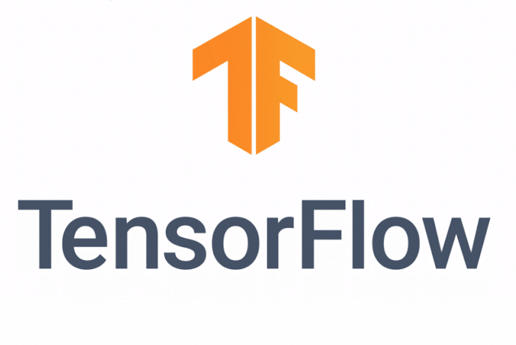
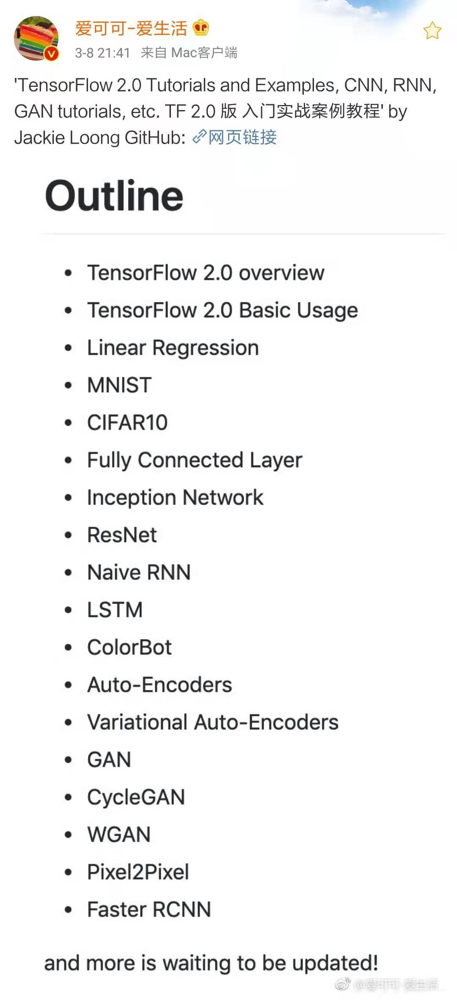

# TensorFlow 2.0 Tutorials 
Our repo. is the **Winner** of [⚡#PoweredByTF 2.0 Challenge!](https://devpost.com/software/tensorflow-2-0-tutorials), and will share **$150,000** prizes with other winners.


<p align="center">
  
</p>

Timeline:
- Jun. 8, 2019: [TensorFlow 2.0 Beta](https://twitter.com/fchollet/status/1134583289384120320)
- Mar. 7, 2019: [Tensorflow 2.0 Alpha](https://www.tensorflow.org/alpha)
- Jan. 11, 2019: [TensorFlow r2.0 preview](https://www.tensorflow.org/versions/r2.0/api_docs/python/tf)
- Aug. 14, 2018: [TensorFlow 2.0 is coming](https://groups.google.com/a/tensorflow.org/forum/#!topic/discuss/bgug1G6a89A)


# Installation

make sure you are using python 3.x.

- CPU install
```python
pip install tensorflow==2.0.0-beta0
```

- GPU install

Install `CUDA 10.0`(or after) and `cudnn` by yourself. and set `LD_LIBRARY_PATH` up.

```python
pip install tensorflow-gpu==2.0.0-beta0
```

Test installation:
```python
In [2]: import tensorflow  as tf

In [3]: tf.__version__
Out[3]: '2.0.0-dev20190129'
In [4]: tf.test.is_gpu_available()
...
totalMemory: 3.95GiB freeMemory: 3.00GiB
...
Out[4]: True

```

 
# Includes

- TensorFlow 2.0 Overview
- TensorFlow 2.0 Basic Usage
- Linear Regression
- MNIST, FashionMNIST
- CIFAR10
- Fully Connected Layer
- VGG16
- Inception Network
- ResNet18
- Naive RNN
- LSTM
- ColorBot
- Auto-Encoders
- Variational Auto-Encoders
- DCGAN
- CycleGAN
- WGAN
- Pixel2Pixel
- Faster RCNN
- A2C
- GPT
- BERT
- GCN

Feel free to submit a **PR** request to make this repo. more complete!
 


# Refered Repos.

Our work is not built from scratch. Great appreciation to these open works！

- https://github.com/madalinabuzau/tensorflow-eager-tutorials
- https://github.com/herbiebradley/CycleGAN-Tensorflow
- https://github.com/tensorflow/tensorflow/blob/master/tensorflow/contrib/eager/python/examples/pix2pix/pix2pix_eager.ipynb
- https://github.com/moono/tf-eager-on-GAN
- https://github.com/Viredery/tf-eager-fasterrcnn
- https://github.com/github/gitignore/blob/master/Python.gitignore
- 

# 配套视频教程

<p align="center">
  <a href="https://study.163.com/course/courseMain.htm?share=2&shareId=480000001847407&courseId=1209092816&_trace_c_p_k2_=dca16f8fd11a4525bac8c89f779b2cfa">
    
  </a>
  
  <a href="https://study.163.com/course/courseMain.htm?share=2&shareId=480000001847407&courseId=1209092816&_trace_c_p_k2_=dca16f8fd11a4525bac8c89f779b2cfa">
    
  </a>
</p> 

TensorFlow 2.0的视频教程链接：[深度学习与TensorFlow 2实战](https://study.163.com/course/courseMain.htm?share=2&shareId=480000001847407&courseId=1209092816&_trace_c_p_k2_=dca16f8fd11a4525bac8c89f779b2cfa)


# Acknowledgement
- 爱可可-爱生活 友情推荐 


