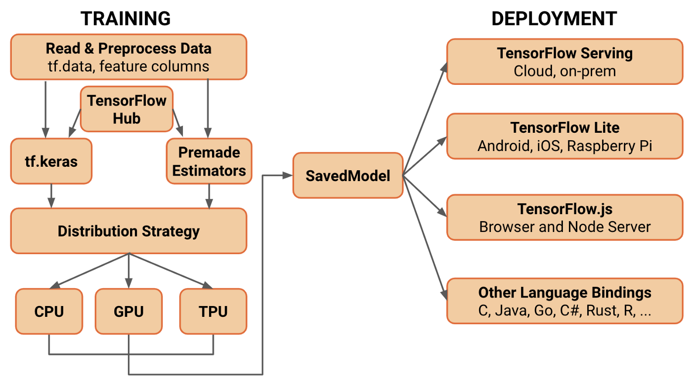

# TensorFlow 2.0 Overview

TensorFlow 2.0 is both simple and flexible, focusing on features like:
- Fast model design and high-level control with Keras
- Estimator API for machine learning workflows, with premade models for regression, boosted trees, and random forests
- Eager execution for imperative programming, with AutoGraph for taking advantage of graph execution
- SavedModel for exporting trained models and deploying on any platform



# First Tutorial

For our first lessons, we'll take a quick look at some MNIST examples with fully-connected and convolutional neural networks to get familiar with the core features of TensorFlow 2.0:

- **tf.keras:** A high-level, object-oriented API for fast prototyping of deep learning models
- **tf.GradientTape:** Records gradients on-the-fly for automatic differentiation and backprop
- **tf.function:** Pre-compile computational graphs from python functions with AutoGraph

# Fully-connected Network

For our first lesson, we'll train a fully-connected neural network for MNIST handwritten digit recognition. Let's start by setting up some methods to load MNIST from **keras.datasets** and preprocess them into rows of normalized 784-dimensional vectors.

```python
import os
import tensorflow as tf
from tensorflow import keras
from tensorflow.keras import layers, optimizers, datasets

os.environ['TF_CPP_MIN_LOG_LEVEL'] = '2'  # or any {'0', '1', '2'}

def mnist_dataset():
  (x, y), _ = datasets.mnist.load_data()
  ds = tf.data.Dataset.from_tensor_slices((x, y))
  ds = ds.map(prepare_mnist_features_and_labels)
  ds = ds.take(20000).shuffle(20000).batch(100)
  return ds

def prepare_mnist_features_and_labels(x, y):
  x = tf.cast(x, tf.float32) / 255.0
  y = tf.cast(y, tf.int64)
  return x, y
```

Now let's build our network as a **keras.Sequential** model and instantiate an ADAM optimizer from **keras.optimizers**.

```python
model = keras.Sequential([
    layers.Reshape(target_shape=(28 * 28,), input_shape=(28, 28)),
    layers.Dense(100, activation='relu'),
    layers.Dense(100, activation='relu'),
    layers.Dense(10)])

optimizer = optimizers.Adam()
```

With our data and model set up, we can start setting up the training procedure. For the methods here, we use the **@tf.function** AutoGraph decorator to pre-compile our methods as TensorFlow computational graphs. TensorFlow 2.0 is fully imperative, so the AutoGraph decorator isn't necessary for our code to work, but it speeds up execution and lets us take advantage of graph execution, so @tf.function is definitely worth using in our case.

```python
@tf.function
def compute_loss(logits, labels):
  return tf.reduce_mean(
      tf.nn.sparse_softmax_cross_entropy_with_logits(
          logits=logits, labels=labels))

@tf.function
def compute_accuracy(logits, labels):
  predictions = tf.argmax(logits, axis=1)
  return tf.reduce_mean(tf.cast(tf.equal(predictions, labels), tf.float32))

@tf.function
def train_one_step(model, optimizer, x, y):

  with tf.GradientTape() as tape:
    logits = model(x)
    loss = compute_loss(logits, y)

  # compute gradient
  grads = tape.gradient(loss, model.trainable_variables)
  # update to weights
  optimizer.apply_gradients(zip(grads, model.trainable_variables))

  accuracy = compute_accuracy(logits, y)

  # loss and accuracy is scalar tensor
  return loss, accuracy

def train(epoch, model, optimizer):

  train_ds = mnist_dataset()
  loss = 0.0
  accuracy = 0.0
  for step, (x, y) in enumerate(train_ds):
    loss, accuracy = train_one_step(model, optimizer, x, y)

    if step % 500 == 0:
      print('epoch', epoch, ': loss', loss.numpy(), '; accuracy', accuracy.numpy())

  return loss, accuracy
```

Now that we have our training procedure set up, we can throw it in a loop and start training!

```python
for epoch in range(20):
  loss, accuracy = train(epoch, model, optimizer)

print('Final epoch', epoch, ': loss', loss.numpy(), '; accuracy', accuracy.numpy())
```

# Convolutional Network

Now that we've gotten our feet we with a simple DNN, let's try something more advanced. Although the process is the same, we'll be working with some additional features:
- Convolution, pooling, and dropout layers for building more complex models
- Visualizing training with TensorBoard
- Validation and test set evaluation for measuring generalizability
- Exporting with SavedModel to save training progress and deploy trained models

As usual, we'll start by preparing our MNIST data.

```python
import os
import time
import numpy as np
import tensorflow as tf
from tensorflow.python.ops import summary_ops_v2
from tensorflow import keras
from tensorflow.keras import datasets, layers, models, optimizers, metrics

os.environ['TF_CPP_MIN_LOG_LEVEL'] = '2'  # or any {'0', '1', '2'}


def mnist_datasets():
    (x_train, y_train), (x_test, y_test) = datasets.mnist.load_data()
    # Numpy defaults to dtype=float64; TF defaults to float32. Stick with float32.
    x_train, x_test = x_train / np.float32(255), x_test / np.float32(255)
    y_train, y_test = y_train.astype(np.int64), y_test.astype(np.int64)
    train_dataset = tf.data.Dataset.from_tensor_slices((x_train, y_train))
    test_dataset = tf.data.Dataset.from_tensor_slices((x_test, y_test))
    return train_dataset, test_dataset


train_ds, test_ds = mnist_datasets()
train_ds = train_ds.shuffle(60000).batch(100)
test_ds = test_ds.batch(100)
```

Now, let's use use Conv2D, MaxPooling2D, and Dropout from **keras.layers** to build a keras.Sequential convolutional model.

```python
model = tf.keras.Sequential([
    layers.Reshape(
        target_shape=[28, 28, 1],
        input_shape=(28, 28,)),
    layers.Conv2D(2, 5, padding='same', activation=tf.nn.relu),
    layers.MaxPooling2D((2, 2), (2, 2), padding='same'),
    layers.Conv2D(4, 5, padding='same', activation=tf.nn.relu),
    layers.MaxPooling2D((2, 2), (2, 2), padding='same'),
    layers.Flatten(),
    layers.Dense(32, activation=tf.nn.relu),
    layers.Dropout(rate=0.4),
    layers.Dense(10)])

optimizer = optimizers.SGD(learning_rate=0.01, momentum=0.5)
```

Next, let's set up forward and backward functionality. In addition to the training procedure, we'll also write test() a method for evaluation, and use **tf.python.summary_ops_v2** to record training summaries to TensorBoard.

```python
compute_loss = tf.keras.losses.SparseCategoricalCrossentropy(from_logits=True)
compute_accuracy = tf.keras.metrics.SparseCategoricalAccuracy()

def train_step(model, optimizer, images, labels):

    # Record the operations used to compute the loss, so that the gradient
    # of the loss with respect to the variables can be computed.
    with tf.GradientTape() as tape:
        logits = model(images, training=True)
        loss = compute_loss(labels, logits)
        compute_accuracy(labels, logits)

    grads = tape.gradient(loss, model.trainable_variables)
    optimizer.apply_gradients(zip(grads, model.trainable_variables))

    return loss

def train(model, optimizer, dataset, log_freq=50):
    """
    Trains model on `dataset` using `optimizer`.
    """
    # Metrics are stateful. They accumulate values and return a cumulative
    # result when you call .result(). Clear accumulated values with .reset_states()
    avg_loss = metrics.Mean('loss', dtype=tf.float32)

    # Datasets can be iterated over like any other Python iterable.
    for images, labels in dataset:
        loss = train_step(model, optimizer, images, labels)
        avg_loss(loss)

        if tf.equal(optimizer.iterations % log_freq, 0):
            # summary_ops_v2.scalar('loss', avg_loss.result(), step=optimizer.iterations)
            # summary_ops_v2.scalar('accuracy', compute_accuracy.result(), step=optimizer.iterations)
            print('step:', int(optimizer.iterations),
                  'loss:', avg_loss.result().numpy(),
                  'acc:', compute_accuracy.result().numpy())
            avg_loss.reset_states()
            compute_accuracy.reset_states()

def test(model, dataset, step_num):
    """
    Perform an evaluation of `model` on the examples from `dataset`.
    """
    avg_loss = metrics.Mean('loss', dtype=tf.float32)

    for (images, labels) in dataset:
        logits = model(images, training=False)
        avg_loss(compute_loss(labels, logits))
        compute_accuracy(labels, logits)

    print('Model test set loss: {:0.4f} accuracy: {:0.2f}%'.format(
        avg_loss.result(), compute_accuracy.result() * 100))

    print('loss:', avg_loss.result(), 'acc:', compute_accuracy.result())
    # summary_ops_v2.scalar('loss', avg_loss.result(), step=step_num)
    # summary_ops_v2.scalar('accuracy', compute_accuracy.result(), step=step_num)
```

Now that we have our data, model, and training procedure ready, we just need to designate a directory and create a **tf.train.Checkpoint** file to save our parameters to as we train.

```python
# Where to save checkpoints, tensorboard summaries, etc.
MODEL_DIR = '/tmp/tensorflow/mnist'


def apply_clean():
    if tf.io.gfile.exists(MODEL_DIR):
        print('Removing existing model dir: {}'.format(MODEL_DIR))
        tf.io.gfile.rmtree(MODEL_DIR)


apply_clean()

checkpoint_dir = os.path.join(MODEL_DIR, 'checkpoints')
checkpoint_prefix = os.path.join(checkpoint_dir, 'ckpt')

checkpoint = tf.train.Checkpoint(model=model, optimizer=optimizer)

# Restore variables on creation if a checkpoint exists.
checkpoint.restore(tf.train.latest_checkpoint(checkpoint_dir))
```

We're finally ready to start training!

```python
NUM_TRAIN_EPOCHS = 5

for i in range(NUM_TRAIN_EPOCHS):
    start = time.time()
    #   with train_summary_writer.as_default():
    train(model, optimizer, train_ds, log_freq=500)
    end = time.time()
    print('Train time for epoch #{} ({} total steps): {}'.format(
        i + 1, int(optimizer.iterations), end - start))
    #   with test_summary_writer.as_default():
    #     test(model, test_ds, optimizer.iterations)
    checkpoint.save(checkpoint_prefix)
    print('saved checkpoint.')

export_path = os.path.join(MODEL_DIR, 'export')
tf.saved_model.save(model, export_path)
print('saved SavedModel for exporting.')
```

# Try it for yourself!
Train MNIST with a **fully connected network**:
```
python fc_train.py
```

Train MNIST with a **convolutional network**:
```
python conv_train.py
```