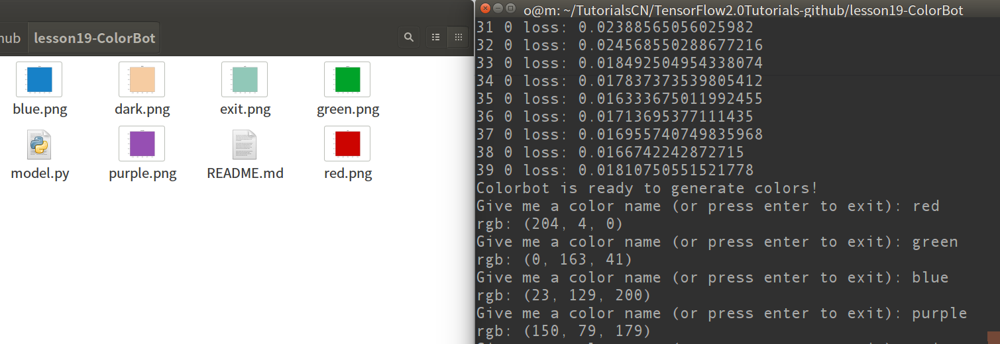

# Color Robot

A simple Color Robot which can draw specific color image give color name.

Here implemented color robot use stacked LSTM and it can accept use input color name and then draw corresponding
color image.

# HowTO

This code will download color dataset automatically.

- Step1. train for 40 epoches.
```
python main.py
```

- Step2. Input a color name and end with `Enter` key. such as `red`, `blue`, `purple`.


- Step3. `Enter` to exit.