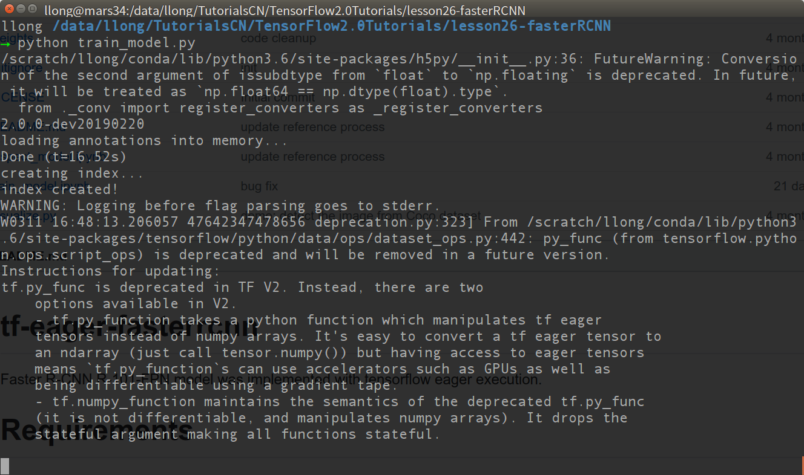

# Faster RCNN

Faster R-CNN R-101-FPN model was implemented with tensorflow 2.0.

# Requirements

- python 3.*
- tensorflow 2.*
- cv2
- ...


# HowTo

- Step1. Download pretrained model from [Google Drive](https://drive.google.com/open?id=12gh8ei9w6MeAXXIxONNR-xdEdTJ8Zkko) or [百度网盘](https://pan.baidu.com/s/1I5PGkpvnDSduJnngoWuktQ) and put it in `weights/faster_rcnn.h5` directory.

- Step2. `pip install required packages` according to your system prompts.

- Step3.

```
python train_model.py
```

- Step4. You may need to check `train_model.ipynb` and `inspect_model.ipynb` for some insight Since Faster-RCNN is a really huge project.


# Screenshot



# Acknowledgement

This work builds on many excellent works, which include:

- Heavily based on [tf-eager-fasterrcnn](https://github.com/Viredery/tf-eager-fasterrcnn)
- [matterport/Mask_RCNN](https://github.com/matterport/Mask_RCNN)
- [open-mmlab/mmdetection](https://github.com/open-mmlab/mmdetection)
