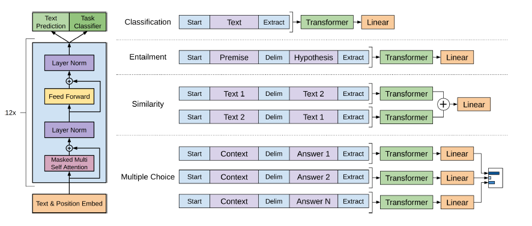

# GPT

TensorFlow 2.0 implementation of OpenAI's GPT (Generative Pre-Training) language model.

# Acknowledgement

This implementation is based on [the Pytorch implementation](https://github.com/huggingface/pytorch-openai-transformer-lm) of OpenAI's paper, ["Improving Language Understanding by Generative Pre-Training"](https://s3-us-west-2.amazonaws.com/openai-assets/research-covers/language-unsupervised/language_understanding_paper.pdf).