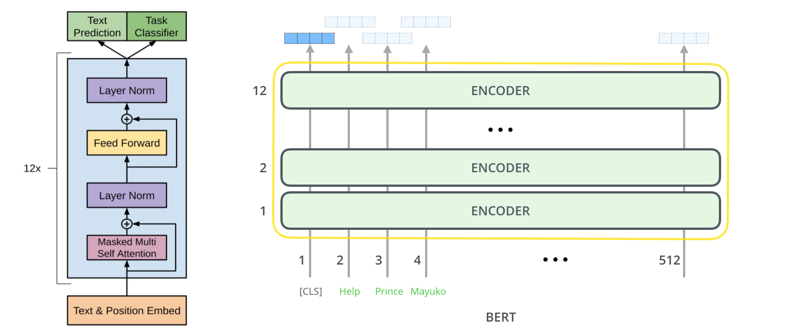

# BERT

TensorFlow 2.0 implementation of Google's BERT (Bidirectional Transformer) language model.

# Acknowledgement

Based on [CyberZHG's Keras BERT implementation](https://github.com/CyberZHG/keras-bert).